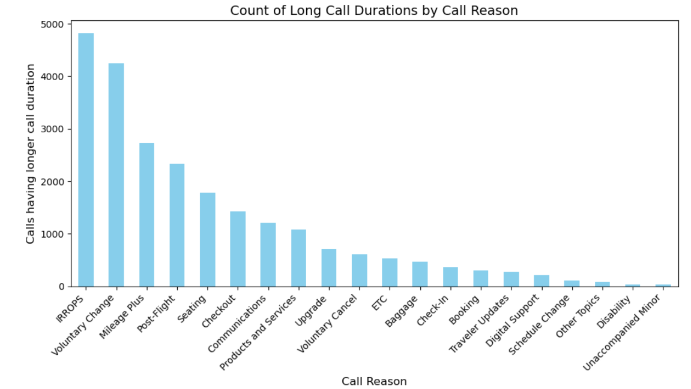

# UA_Call_CenterOpti

## United Airlines Call Center Performance Optimization

The objective of the project is the analyze the call center performance and seek ways to reduce operating time per customer. Given the call duration, reason, transcripts, agent and call emotion and sentiments. The objective is to reduce the handling time per call, and identify root causes for lower overall center performance and find ways to improve functionality.

The steps taken:
1. Clean data: Remove duplicates and normalize data ( normalize call reason types, call duration etc)
2. Analyze data and identify factors contributing to longer AHT
3. Analyze reason for recurring calls
4. Identify ways to improve IVR
5. Identify places for call center optimization

### Primary Call Reason Types

### Calls with longer AHT

### Interaction Review

### Contribution to long calls

### Factors causing longer average handle time
The top 10 longest call conversations were analyzed to understand the reason for longer call durations. Similarly the shortest 10 calls were also viewed to analyze the factors that could reduce call duration.
The primary factors contribute to longer call durations are:
1. Irregular flight operations
2. Voluntary flight rescheduling by the passengers
3. Mileage Plus
4. On- call rescheduling process takes significant time

### Improvements for IVR
There are queries that can be generic and resolved through digital support mediums without the requirement for special assistance through customer care.
Call reasons: 
1. Voluntary flight cancel – 2.8%
2. Booking status verification – 1.28%
3. Traveler updates : Flight status update for passenger – 0.97%
4. Seating – 6.54%
### Total – 11.6% of major long duration calls

- Automating the above call types through IVR. Can reduce 11% of long calls
- An option to provide the flight details, before customer care support. Could contribute to call duration reduction

## Optimizing call center performance
1. Overbooked flights:
Passengers unaware that their ticket was overbooked are frustrated about cancelled tickets on call. This could be mitigated by adding an “Overbook” feature on the ticket booking apps. This would inform the passengers about their type of booking and Terms and Conditions, and could ease call duration and sentiments.

2. IRROPS
Flight cancellation by airlines due to IRROPS are a major contributor to the calls. To optimize call durations, agents could be assigned to specific flight cancellations/IRROPS, so that lesser time could be taken to assist passengers having the same issue with the flight. Furthermore this could reduce wait time for calls.

3. IVR Improvements
Automating the flight status checking procedure through IVR, voluntary flight cancellation, seating, mileage plus could lead to a 11 percent reduction in operation. As these are issues that don’t necessarily require agent support

Furthermore, through the use of NLP, the call transcripts could be analyzed to designate the primary call reason type. There are multiple calls that have been mis-labelled as communications for a voluntary change type call. These errors could be reduced. This could reduce time spent by agent to manually enter call type. 
Chatbots can be trained to answer generic queries like booking status verification etc.
Development of software's that could efficiently assist agents with the flight rescheduling work, by finding the best suited flight timings according to passenger’s requirements

